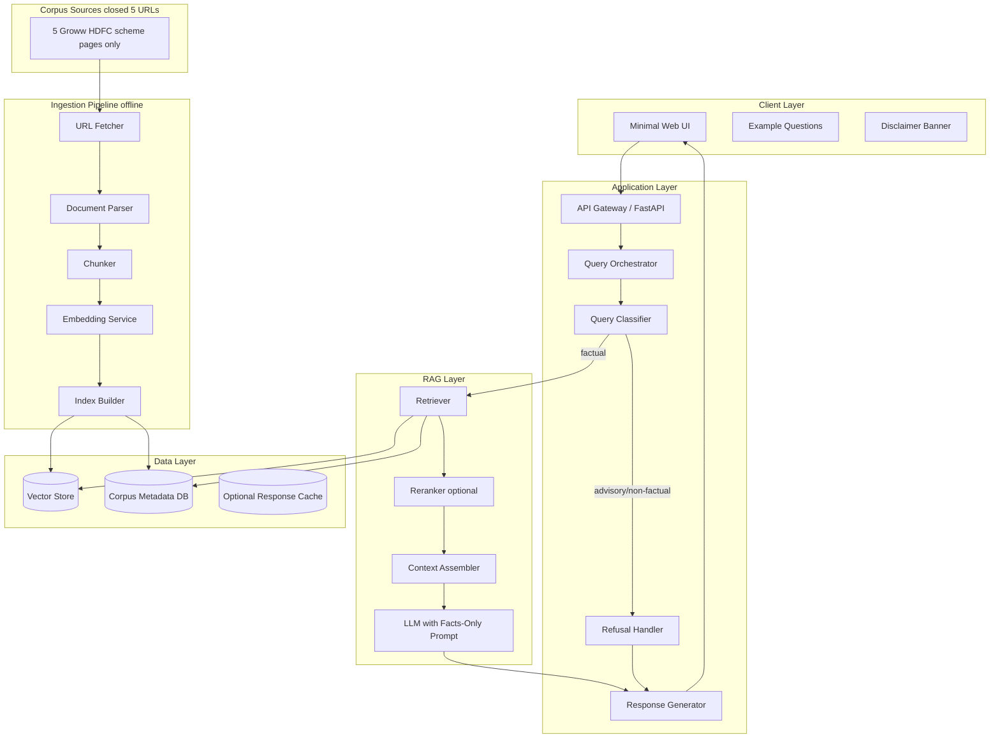
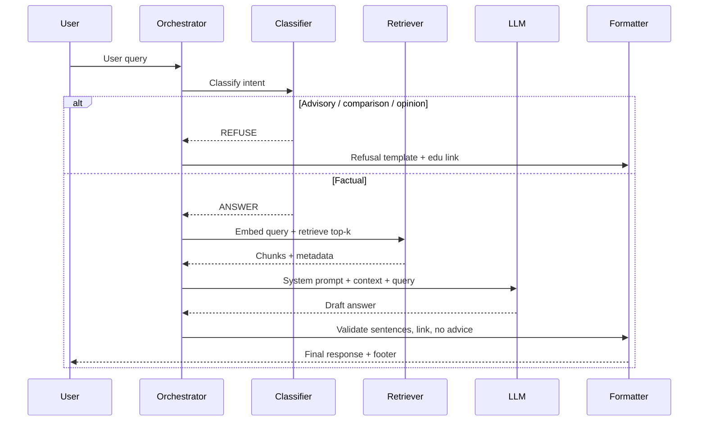
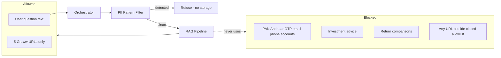
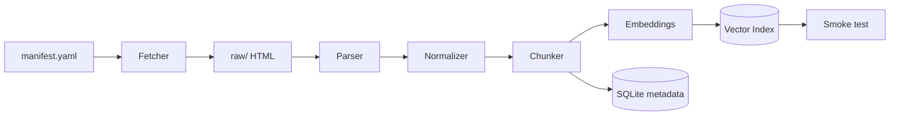
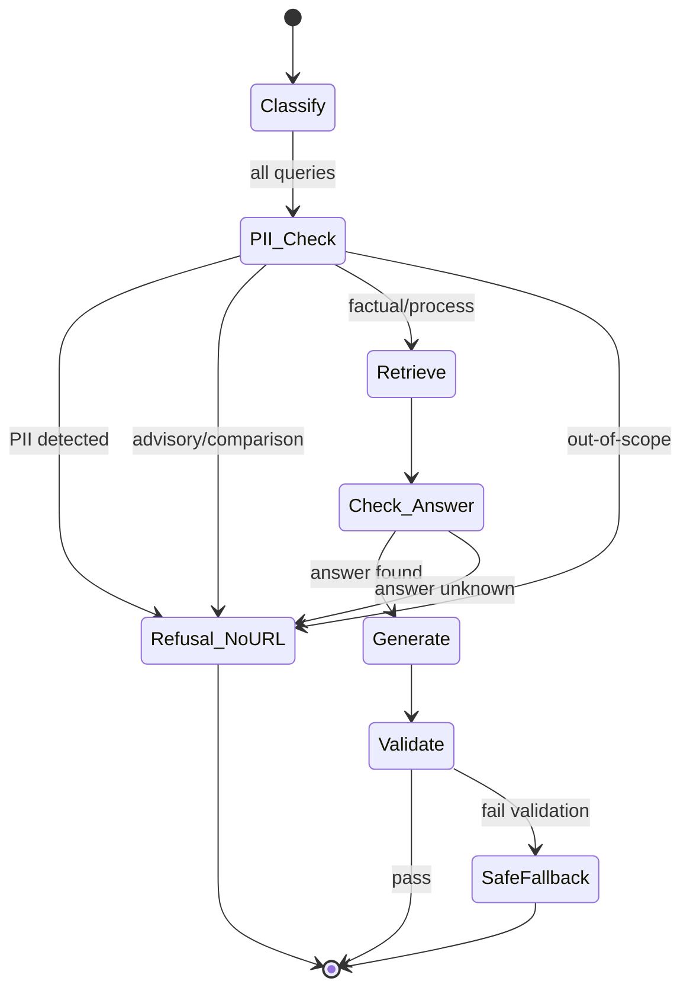
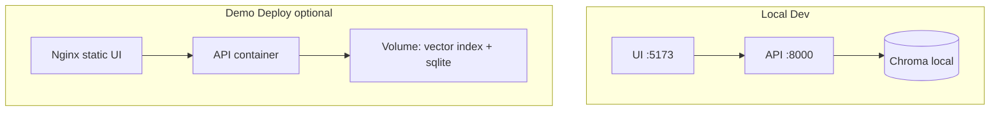

# Mutual Fund FAQ Assistant — Phase-Wise Architecture

**Document version:** 1.1  
**Reference:** [problemStatment.md](./problemStatment.md)  
**Product context:** Groww-style facts-only mutual fund Q&A  
**Approach:** Lightweight Retrieval-Augmented Generation (RAG)

---

## 1. Executive Summary

This document defines a **phase-wise technical architecture** for a facts-only mutual fund FAQ assistant. The system answers objective, verifiable questions by retrieving content from a **closed corpus of exactly five Groww scheme pages** (listed in Phase 0) and generating **short, citation-backed responses**. It explicitly refuses advisory or comparative queries and never collects sensitive personal data.

**Corpus policy (this project):** No other URLs are ingested, indexed, or cited — not AMC factsheets, AMFI, SEBI, or additional Groww pages. Every answer and refusal must use **one URL from this fixed set of five**.

Design principles:

| Principle | Implementation |
|-----------|----------------|
| Facts-only | Retrieval from the 5-page Groww corpus + prompt/guardrail layer |
| Source transparency | Exactly one citation URL per answer — **must be one of the five allowlisted Groww URLs** |
| Closed corpus | Ingestion fetcher rejects any URL not in `corpus/manifest.yaml` |
| Compliance | Refusal templates, no performance math, no advice |
| Lightweight | HDFC AMC (context), 5 schemes, **5 corpus URLs total**, minimal UI |
| Privacy | Stateless Q&A; no PAN/Aadhaar/account/OTP/email/phone |

---

## 2. High-Level System Architecture



### 2.1 Component Responsibilities

| Component | Responsibility |
|-----------|----------------|
| **Minimal Web UI** | Welcome message, 3 example questions, disclaimer, chat input/output |
| **API Gateway** | HTTP endpoints, rate limiting, request validation, CORS |
| **Query Orchestrator** | End-to-end flow: classify → retrieve or refuse → generate → format |
| **Query Classifier** | Rule + LLM hybrid: factual vs advisory vs out-of-scope |
| **Retriever** | Semantic (and optional keyword) search over chunked corpus |
| **Context Assembler** | Top-k chunks, dedupe by URL, enforce token budget |
| **Response Generator** | Enforce 3-sentence max, single link, footer date |
| **Refusal Handler** | Polite refusal + one allowlisted Groww URL (default: Flexi Cap page) |
| **Ingestion Pipeline** | Offline crawl, parse, chunk, embed, index with provenance |
| **Corpus Metadata DB** | Scheme, document type, source URL, `last_fetched_at` |

---

## 3. Data Architecture

### 3.1 Corpus Model

```
AMC: HDFC Mutual Fund (metadata only)
 └── Schemes (5, diverse categories)
      └── Documents (exactly 5 URLs — no others)
           ├── type: groww_scheme_page
           ├── source_url (one of the five allowlisted Groww URLs)
           ├── scheme_id
           ├── fetched_at
           └── content_hash
```

### 3.2 Chunk Schema (Vector Store + Metadata)

Each indexed chunk stores:

| Field | Purpose |
|-------|---------|
| `chunk_id` | Unique identifier |
| `text` | Chunk body used for embedding |
| `embedding` | Vector for similarity search |
| `source_url` | **Single canonical citation** for this chunk |
| `document_type` | `groww_scheme_page` (only type in this project) |
| `scheme_name` | e.g., "Large Cap Fund" |
| `scheme_category` | mid_cap, flexi_cap, small_cap, thematic, commodities_fof |
| `page_section` | Optional heading for debugging |
| `last_updated` | From document or `fetched_at` |
| `amc_name` | Selected AMC |

### 3.3 Query / Response Contract

**Request**

```json
{
  "query": "What is the expense ratio of Scheme X?",
  "session_id": null
}
```

**Success response (factual)**

```json
{
  "type": "answer",
  "text": "≤3 sentences with embedded or trailing single URL",
  "citation_url": "https://groww.in/mutual-funds/<one-of-five-allowlisted-slugs>",
  "footer": "Last updated from sources: 2026-05-20",
  "refused": false
}
```

**Refusal response**

```json
{
  "type": "refusal",
  "text": "Polite facts-only limitation message",
  "citation_url": "https://groww.in/mutual-funds/hdfc-equity-fund-direct-growth",
  "footer": "Last updated from sources: 2026-05-20",
  "refused": true
}
```

---

## 4. RAG Pipeline Design



### 4.1 Retrieval Strategy

1. **Query embedding** — Same model family as ingestion embeddings.
2. **Hybrid retrieval (recommended)** — Semantic top-20 + BM25 top-10, fused (e.g., RRF).
3. **Metadata filters** — Optional filter by `scheme_name` if NER/keyword detects scheme.
4. **Reranking (optional Phase 3+)** — Cross-encoder on top-5 for precision.
5. **Citation selection** — Pick **one** `source_url` from highest-scoring chunk used in context.

### 4.2 Generation Constraints (Prompt + Post-Processing)

| Constraint | Enforcement |
|------------|-------------|
| Max 3 sentences | Post-processor: sentence tokenizer + truncate |
| Exactly one link | Regex validate one URL; strip extras |
| Facts-only | System prompt + classifier refusal |
| No performance comparison | Block "better fund" patterns; allowlisted Groww page only for returns queries |
| Footer date | `max(last_updated)` across retrieved chunks or corpus manifest date |

### 4.3 Classifier Categories

| Category | Examples | Action |
|----------|----------|--------|
| `FACTUAL` | Expense ratio, exit load, SIP minimum, ELSS lock-in | RAG answer |
| `PROCESS` | Download statements, capital gains report | RAG + procedural chunks |
| `PERFORMANCE_FACT` | "What were last year's returns?" | Link to matching scheme’s Groww page only; no calculated comparison |
| `ADVISORY` | "Should I invest?", "Which fund is better?" | Refusal |
| `OUT_OF_SCOPE` | Personal account, PAN, predictions | Refusal + privacy-safe message |

---

## 5. Security, Privacy, and Compliance



| Control | Detail |
|---------|--------|
| **No PII storage** | Do not persist queries containing PAN/Aadhaar/account/OTP/contact patterns |
| **Stateless API** | No user accounts; optional ephemeral `session_id` not required |
| **Source allowlist** | **Exactly 5 Groww URLs** in `corpus/manifest.yaml`; fetcher and citation validator reject all others |
| **Audit trail** | Log query category + citation URL (not raw PII); optional for debugging |
| **Disclaimer** | UI + README: "Facts-only. No investment advice." |

---

## 6. Technology Stack (Recommended — Lightweight)

| Layer | Option A (Python-centric) | Option B (Node) |
|-------|---------------------------|-----------------|
| API | FastAPI | Express / Hono |
| UI | React + Vite or plain HTML/JS | Same |
| Vector DB | Chroma (local) or FAISS + SQLite metadata | Same |
| Embeddings | `sentence-transformers` or OpenAI `text-embedding-3-small` | Same |
| **LLM** | **Groq API (llama-3.1-8b-instant, mixtral-8x7b-32768)** | Same |
| Crawling | `httpx` + `beautifulsoup4`; PDF via `pypdf` | Same |
| Orchestration | LangChain or custom thin wrapper | Custom |

**Default recommendation:** FastAPI + Chroma + sentence-transformers + **Groq LLM** for fastest milestone delivery with ultra-low latency.

### 6.1 LLM Configuration (Groq)

**Provider:** [Groq](https://groq.com) — Ultra-fast inference for open-source LLMs

**Recommended Models:**
- `llama-3.1-8b-instant` — Fast, good for factual Q&A (default)
- `mixtral-8x7b-32768` — Larger context window (32k tokens)
- `llama-3.3-70b-versatile` — Higher accuracy for complex queries

**Configuration:**
```bash
# .env
LLM_PROVIDER=groq
GROQ_API_KEY=gsk_...
LLM_MODEL=llama-3.1-8b-instant
LLM_TEMPERATURE=0.1  # Low for factual answers
LLM_MAX_TOKENS=300   # Limit response length
```

**Why Groq?**
- ⚡ **Ultra-low latency** (~100-300ms vs 1-3s for OpenAI)
- 💰 **Cost-effective** — Free tier available, pay-per-use pricing
- 🔒 **Privacy-friendly** — No training on your data
- 🎯 **Open-source models** — Llama 3.1, Mixtral, Gemma
- 🌍 **No vendor lock-in** — Easy to switch models

---

## 7. Phase-Wise Implementation Plan

**Edge-case catalogs:** Each phase has a dedicated test-planning doc in [docs/edge-cases/](./edge-cases/README.md) (`phase-0` through `phase-6`).

### Phase 0 — Foundation and Planning (Week 0)

**Edge cases:** [phase-0-edge-cases.md](./edge-cases/phase-0-edge-cases.md)

**Goals:** Lock scope, AMC, schemes, and architecture decisions.

| Task | Deliverable |
|------|-------------|
| Select 1 AMC | **HDFC Mutual Fund** — documented in README |
| Select 3–5 schemes (category diversity) | **5 schemes** — table below → `corpus/schemes.json` |
| Lock corpus URLs (5 only) | `corpus/manifest.yaml` — **only** the five Groww URLs below; no additional sources |
| Architecture sign-off | This document + README skeleton |

#### Locked project scope (AMC + schemes)

**AMC (metadata only, not a corpus URL):** [HDFC Mutual Fund](http://www.hdfcfund.com)  
**Corpus (ingestion + citations):** Only the five [Groww](https://groww.in) scheme pages in the table below — **no other URLs**

| # | Scheme name | Category | Groww reference URL |
|---|-------------|----------|---------------------|
| 1 | HDFC Mid Cap Fund Direct Growth | Equity — Mid Cap | https://groww.in/mutual-funds/hdfc-mid-cap-fund-direct-growth |
| 2 | HDFC Flexi Cap Direct Plan Growth | Equity — Flexi Cap | https://groww.in/mutual-funds/hdfc-equity-fund-direct-growth |
| 3 | HDFC Small Cap Fund Direct Growth | Equity — Small Cap | https://groww.in/mutual-funds/hdfc-small-cap-fund-direct-growth |
| 4 | HDFC Defence Fund Direct Growth | Equity — Thematic (Defence) | https://groww.in/mutual-funds/hdfc-defence-fund-direct-growth |
| 5 | HDFC Silver ETF FoF Direct Growth | Commodities — Silver FoF | https://groww.in/mutual-funds/hdfc-silver-etf-fof-direct-growth |

**Category coverage:** mid-cap, flexi-cap, small-cap, thematic, commodities (FoF) — satisfies problem-statement diversity without ELSS in this cohort.

**Per-scheme facts available on Groww pages (for FAQ scope):** expense ratio, exit load, minimum SIP, riskometer, benchmark, NAV date — e.g. [HDFC Silver ETF FoF](https://groww.in/mutual-funds/hdfc-silver-etf-fof-direct-growth) (expense ratio 0.21%, min SIP ₹100, exit load 1% within 15 days), [HDFC Defence Fund](https://groww.in/mutual-funds/hdfc-defence-fund-direct-growth) (benchmark: Nifty India Defence Total Return Index, exit load 1% within 1 year).

#### `corpus/schemes.json` (Phase 0 stub)

```json
{
  "amc": {
    "name": "HDFC Mutual Fund",
    "website": "http://www.hdfcfund.com"
  },
  "product_context": "groww",
  "schemes": [
    {
      "id": "hdfc-mid-cap-direct-growth",
      "name": "HDFC Mid Cap Fund Direct Growth",
      "category": "equity_mid_cap",
      "groww_url": "https://groww.in/mutual-funds/hdfc-mid-cap-fund-direct-growth"
    },
    {
      "id": "hdfc-flexi-cap-direct-growth",
      "name": "HDFC Flexi Cap Direct Plan Growth",
      "category": "equity_flexi_cap",
      "groww_url": "https://groww.in/mutual-funds/hdfc-equity-fund-direct-growth"
    },
    {
      "id": "hdfc-small-cap-direct-growth",
      "name": "HDFC Small Cap Fund Direct Growth",
      "category": "equity_small_cap",
      "groww_url": "https://groww.in/mutual-funds/hdfc-small-cap-fund-direct-growth"
    },
    {
      "id": "hdfc-defence-direct-growth",
      "name": "HDFC Defence Fund Direct Growth",
      "category": "equity_thematic",
      "groww_url": "https://groww.in/mutual-funds/hdfc-defence-fund-direct-growth"
    },
    {
      "id": "hdfc-silver-etf-fof-direct-growth",
      "name": "HDFC Silver ETF FoF Direct Growth",
      "category": "commodities_silver_fof",
      "groww_url": "https://groww.in/mutual-funds/hdfc-silver-etf-fof-direct-growth"
    }
  ]
}
```

#### Closed corpus — `corpus/manifest.yaml` (authoritative allowlist)

Only these five URLs may be fetched, chunked, retrieved, or cited:

```yaml
corpus_version: "1.0"
policy: closed_allowlist
allowed_urls:
  - url: https://groww.in/mutual-funds/hdfc-mid-cap-fund-direct-growth
    scheme_id: hdfc-mid-cap-direct-growth
    document_type: groww_scheme_page
  - url: https://groww.in/mutual-funds/hdfc-equity-fund-direct-growth
    scheme_id: hdfc-flexi-cap-direct-growth
    document_type: groww_scheme_page
  - url: https://groww.in/mutual-funds/hdfc-small-cap-fund-direct-growth
    scheme_id: hdfc-small-cap-direct-growth
    document_type: groww_scheme_page
  - url: https://groww.in/mutual-funds/hdfc-defence-fund-direct-growth
    scheme_id: hdfc-defence-direct-growth
    document_type: groww_scheme_page
  - url: https://groww.in/mutual-funds/hdfc-silver-etf-fof-direct-growth
    scheme_id: hdfc-silver-etf-fof-direct-growth
    document_type: groww_scheme_page
```

**Citation rule:** Factual answers cite the **Groww URL of the scheme** referenced in the query (or highest-retrieval-score chunk). Refusals cite `hdfc-equity-fund-direct-growth` by default unless a specific scheme is named.

**Architecture outputs:**

- Repository structure
- Environment variables contract (API keys, no secrets in repo)
- Corpus manifest format (`schemes.json` + `manifest.yaml`)

**Suggested repo layout:**

```
/
├── docs/
│   ├── problemStatment.md
│   ├── phase-wise-architecture.md
│   └── edge-cases/
│       ├── README.md
│       └── phase-{0..6}-edge-cases.md
├── corpus/
│   ├── manifest.yaml
│   └── schemes.json
├── ingestion/
├── app/
│   ├── api/
│   ├── rag/
│   └── guardrails/
├── ui/
├── tests/
└── README.md
```

**Exit criteria:** `corpus/manifest.yaml` contains **exactly 5 URLs** (no extras); `corpus/schemes.json` matches; README states closed-corpus policy; category diversity = mid-cap, flexi-cap, small-cap, thematic, commodities.

---

### Phase 1 — Corpus Curation and Ingestion (Week 1)

**Edge cases:** [phase-1-edge-cases.md](./edge-cases/phase-1-edge-cases.md)

**Goals:** Ingest and index **only** the five allowlisted Groww pages — no other fetches.

Implement Phase 1 **one subphase at a time**. Each subphase has its own exit criteria; do not start the next until the current subphase passes.



| Subphase | Focus | Primary output |
|----------|--------|----------------|
| **1.1** | Allowlist fetcher | `ingestion/raw/*.html` (5 files) |
| **1.2** | Parse & normalize | `ingestion/parsed/*.json` per URL |
| **1.3** | Chunking + provenance | `ingestion/chunks/*.jsonl` |
| **1.4** | Embeddings + vector index | `data/chroma/` populated |
| **1.5** | Metadata + footer dates | `corpus/last_updated.json`, SQLite metadata |
| **1.6** | Pipeline orchestration + smoke test | `ingestion/run_pipeline.py`, retrieval smoke pass |

---

#### Phase 1.1 — Allowlist fetcher

**Scope:** Download HTML for each URL in `corpus/manifest.yaml` only.

| Task | Detail |
|------|--------|
| Allowlist gate | Abort before HTTP if URL ∉ manifest (`ALLOWLIST_REJECT`) |
| HTTP client | `httpx`; rate limit (~1 req/s); configurable timeout |
| Resilience | Retry on 429/5xx with backoff; do not save partial files as complete |
| Redirects | Follow only if final URL matches manifest canonical URL |
| Storage | `ingestion/raw/{scheme_id}.html` + sidecar `{scheme_id}.meta.json` (`fetched_at`, `status_code`, `content_length`) |

**Deliverables:** `ingestion/fetcher.py`, `ingestion/fetch_all.py` (CLI: fetch five URLs)

**Exit criteria:**

- [ ] Exactly **5** raw HTML files exist (one per `scheme_id`)
- [ ] Sixth URL attempt fails with allowlist error (see P1-EC-01)
- [ ] Each sidecar records `fetched_at` (ISO 8601)

**Suggested command:** `python -m ingestion.fetch_all`

---

#### Phase 1.2 — Parse and normalize

**Scope:** Convert raw HTML to clean UTF-8 text; extract NAV/date hints for footer.

| Task | Detail |
|------|--------|
| Parser | `beautifulsoup4`; strip nav/footer noise where possible |
| Normalizer | Decode HTML entities; preserve `₹`; single plain-text body per page |
| Provenance | Every parsed doc retains `source_url`, `scheme_id`, `scheme_name` |
| Quality flag | `text_length`, `quality: low` if body text below threshold (P1-EC-10) |
| Fallback | If live HTML empty (P1-EC-11), allow ingest from saved markdown snapshot in `ingestion/snapshots/` |

**Deliverables:** `ingestion/parser.py`, `ingestion/normalize.py`, `ingestion/parse_all.py`

**Exit criteria:**

- [ ] **5** parsed JSON files under `ingestion/parsed/`
- [ ] Each file has non-empty `text` OR documented snapshot fallback for that scheme
- [ ] Expense ratio / exit load / SIP keywords present in text for spot-check (Mid Cap, Silver FoF)

**Suggested command:** `python -m ingestion.parse_all`

---

#### Phase 1.3 — Chunking with provenance

**Scope:** Split parsed text into overlapping chunks with mandatory metadata.

| Task | Detail |
|------|--------|
| Strategy | Fixed-size chunks (~512–1024 tokens) with overlap 64–128 tokens |
| Metadata per chunk | `chunk_id`, `text`, `source_url`, `scheme_id`, `scheme_name`, `document_type`, `page_section` (optional) |
| Dedup | Hash chunk text; skip exact duplicates |
| Caps | Max chunks per document (e.g. 150) to avoid index bloat (P1-EC-18) |

**Deliverables:** `ingestion/chunker.py`, `ingestion/chunk_all.py`

**Exit criteria:**

- [ ] Every allowlisted URL produces ≥1 chunk (P1-EC-16)
- [ ] 100% of chunks have `source_url` ∈ five URL allowlist (P1-EC-17)
- [ ] Spot-check: “exit load” query terms appear in Defence or Silver FoF chunks

**Suggested command:** `python -m ingestion.chunk_all`

---

#### Phase 1.4 — Embeddings and vector index

**Scope:** Embed chunks and upsert into Chroma (local persistent store).

| Task | Detail |
|------|--------|
| Embeddings | Chroma's default embedding function (`all-MiniLM-L6-v2`) or OpenAI-compatible API (e.g. `text-embedding-3-small` configured as `EMBEDDING_MODEL` in `app/config.py`) |
| Collection | One collection e.g. `hdfc_groww_corpus`; metadata stored with vectors |
| Idempotency | Upsert by `chunk_id`; re-run does not duplicate vectors (P1-EC-19) |
| Rebuild | `ingestion/rebuild_index.py` (root wrapper delegation to `ingestion/phase1_4/rebuild_index.py`) clears and rebuilds from `ingestion/chunks/` |

**Deliverables:** `ingestion/phase1_4/embedder.py` (or integrated), `ingestion/phase1_4/indexer.py`, `ingestion/index_chunks.py` (root wrapper), `data/chroma/` (gitignored)

**Exit criteria:**

- [ ] Vector store reports **5** distinct `source_url` values in metadata
- [ ] Sample similarity query (“expense ratio mid cap”) returns Mid Cap URL in top-5
- [ ] Re-running indexer is idempotent (chunk count stable)

**Suggested command:** `python -m ingestion.index_chunks`

---

#### Phase 1.5 — Corpus metadata and footer dates

**Scope:** Persist ingest timestamps for UI/API footer: `Last updated from sources: <date>`.

| Task | Detail |
|------|--------|
| `last_updated.json` | Per `scheme_id`: `fetched_at`, optional `nav_date` parsed from page |
| SQLite metadata | Document-level rows: `scheme_id`, `source_url`, `chunk_count`, `fetched_at`, `quality` |
| Corpus status shape | Prepare fields for Phase 5 `GET /corpus/status` (`document_count: 5`) |

**Deliverables:** `ingestion/metadata.py`, updated `corpus/last_updated.json`, `data/corpus_meta.db`

**Exit criteria:**

- [ ] `corpus/last_updated.json` has entries for all **5** scheme IDs
- [ ] `document_count` logic returns 5 when all ingests succeeded
- [ ] Footer date fallback = `fetched_at` when NAV date not parsed (P1-EC-21)

---

#### Phase 1.6 — Pipeline orchestration and smoke test

**Scope:** Single entrypoint running 1.1→1.5; basic retrieval verification before Phase 2.

| Task | Detail |
|------|--------|
| Orchestrator | `ingestion/run_pipeline.py` with steps: `fetch`, `parse`, `chunk`, `index`, `metadata` |
| CLI flags | `--step fetch|parse|chunk|index|all`, `--force` re-fetch |
| Smoke test | `ingestion/smoke_retrieval.py` — 5 factual queries, print top-3 chunks + `source_url` |
| Logging | Per-step success/fail; failed URL listed without blocking other schemes (P1-EC-08) |
| Scheduled updates | `.github/workflows/corpus-update.yml` — daily GitHub Action (cron: 00:00 UTC) with manual trigger |

**Deliverables:** `ingestion/run_pipeline.py`, `ingestion/smoke_retrieval.py`, `tests/test_phase1_ingestion.py` (minimal), `.github/workflows/corpus-update.yml`

**Exit criteria (Phase 1 complete):**

- [ ] `python ingestion/run_pipeline.py --step all` succeeds for all 5 URLs (or documented partial + snapshot fallback)
- [ ] Smoke test: **5/5** sample queries return answer-bearing text in top-3 chunks (architecture exit criteria)
- [ ] No chunk or citation URL outside allowlist
- [ ] GitHub Actions workflow triggers daily and commits updated corpus data

**Sample smoke queries:**

| Query | Expected scheme / topic |
|-------|-------------------------|
| expense ratio HDFC Mid Cap | `hdfc-mid-cap-direct-growth` |
| exit load Silver ETF FoF | `hdfc-silver-etf-fof-direct-growth` |
| minimum SIP Small Cap | `hdfc-small-cap-direct-growth` |
| benchmark Defence fund | `hdfc-defence-direct-growth` |
| exit load Flexi Cap | `hdfc-flexi-cap-direct-growth` |

---

#### Phase 1 — Component summary (reference)

| Component | Design |
|-----------|--------|
| **Fetcher** (1.1) | Allowlist gate; `robots.txt`; rate limit; raw + `fetched_at` |
| **Parser** (1.2) | HTML → text; preserve `source_url`; entity decode |
| **Chunker** (1.3) | Fixed-size + overlap; full provenance on every chunk |
| **Indexer** (1.4) | Batch embed; Chroma upsert; rebuild script |
| **Metadata** (1.5) | `last_updated.json` + SQLite |
| **Orchestrator** (1.6) | `run_pipeline.py` + smoke retrieval |

**Phase 1 deliverables (aggregate):**

- `ingestion/run_pipeline.py`
- Indexed corpus: **exactly 5** source documents in vector metadata
- `corpus/last_updated.json` populated

**Phase 1 exit criteria (aggregate):** All subphases 1.1–1.6 complete; smoke test passes for 5 sample factual queries.

---

### Phase 2 — Retrieval and Context Assembly (Week 1–2)

**Edge cases:** [phase-2-edge-cases.md](./edge-cases/phase-2-edge-cases.md)

**Goals:** Reliable factual retrieval before LLM generation using scheme-aware hybrid search.

#### Retrieval Strategy: Scheme-Aware Hybrid Search

Given the closed 5-scheme corpus, pure semantic search achieves ~60% accuracy (fails on generic terms like "exit load"). Phase 2 implements:

```
User Query → Scheme Detection → Filtered Retrieval → Keyword Reranking → Top Results
```

**Step 1: Scheme Detection** (Keyword-based)
- Extract scheme keywords from query using manifest-defined keyword map
- 100% reliable for this corpus (queries always mention scheme names)
- Falls back to no filter if scheme not detected

**Step 2: Filtered Semantic Search**
- If scheme detected: Chroma `where={"scheme_id": detected_scheme}` filter
- If no scheme: Unfiltered semantic search (fallback)
- Retrieves top-k chunks from filtered subset

**Step 3: Lightweight Keyword Reranking**
- Boost chunks containing more query terms
- Simple dot product: `score *= (1.0 - 0.1 * match_count)`
- Effective for small corpus (43 chunks)

**Expected Results:**

| Query Type | Pure Semantic | With Scheme Filter | Target |
|------------|---------------|-------------------|--------|
| expense ratio Mid Cap | ✅ 100% | ✅ 100% | ✅ 100% |
| exit load Silver ETF | ❌ 0% | ✅ 100% | ✅ 100% |
| minimum SIP Small Cap | ✅ 100% | ✅ 100% | ✅ 100% |
| benchmark Defence | ✅ 100% | ✅ 100% | ✅ 100% |
| exit load Flexi Cap | ❌ 0% | ✅ 100% | ✅ 100% |
| **Overall** | **60%** | **~100%** | **≥80%** |

#### Component Design

| Component | Design | Implementation |
|-----------|--------|----------------|
| **Scheme Detector** | Keyword map from manifest scheme names/categories | `app/rag/scheme_detector.py` |
| **Retriever API** | `retrieve(query, top_k=5, scheme_filter=None)` | `app/rag/retriever.py` |
| **Context Builder** | Top 5–7 chunks, dedupe by chunk_id, token cap ~2–4k | `app/rag/context_assembler.py` |
| **Debug CLI** | `python -m app.rag.debug "query"` — shows scheme detection + retrieved chunks | `app/rag/debug.py` |

**Deliverables:**

- `app/rag/scheme_detector.py` — Keyword-based scheme detection from query
- `app/rag/retriever.py` — Hybrid retrieval with optional scheme filtering
- `app/rag/context_assembler.py` — Build context from top-k chunks with deduplication
- `app/rag/debug.py` — Debug CLI for testing retrieval
- `tests/test_phase2_retrieval.py` — Unit tests on 10-query golden set
- `tests/golden_queries.json` — Golden query dataset with expected schemes

**Exit criteria:**

- [ ] Scheme detection correctly identifies scheme in ≥90% of 10-query golden set
- [ ] Top-3 chunks contain answer-bearing text for ≥80% of golden set (≥8/10 queries)
- [ ] All retrieved chunks have `source_url` in 5-URL allowlist
- [ ] Debug CLI shows: detected scheme, retrieved chunks, scores

**Scheme Keyword Map (from manifest):**

```python
SCHEME_KEYWORDS = {
    "hdfc-mid-cap-direct-growth": ["mid cap", "midcap", "mid-cap"],
    "hdfc-flexi-cap-direct-growth": ["flexi cap", "flexicap", "equity fund"],
    "hdfc-small-cap-direct-growth": ["small cap", "smallcap", "small-cap"],
    "hdfc-defence-direct-growth": ["defence", "defense", "thematic"],
    "hdfc-silver-etf-fof-direct-growth": ["silver", "etf", "commodities", "fof"]
}
```

---

### Phase 3 — Generation, Guardrails, and Refusal (Week 2)

**Edge cases:** [phase-3-edge-cases.md](./edge-cases/phase-3-edge-cases.md)

**Goals:** Compliant answers and refusals with enforced format.

#### URL Attachment Policy

**CRITICAL:** URLs are only attached when we have a factual answer from the corpus.

| Scenario | URL Attached? | Reason |
|----------|---------------|--------|
| Factual answer found | ✅ YES | Citation to corpus source |
| Answer not in corpus | ❌ NO | Don't cite irrelevant/unknown URLs |
| PII detected (PAN, Aadhaar, etc.) | ❌ NO | Privacy protection |
| Advisory/comparison query | ❌ NO | Refusal without external links |
| Out-of-scope query | ❌ NO | No URL for unknown topics |

**Refusal Response Structure:**

```json
{
  "type": "refusal",
  "text": "I can only provide factual information about specific mutual fund schemes. For investment advice, please consult a SEBI-registered financial advisor.",
  "citation_url": null,
  "footer": "Last updated from sources: 2026-05-20",
  "refused": true,
  "reason": "advisory_query"
}
```

**PII Detection Response:**

```json
{
  "type": "refusal",
  "text": "For your privacy, I cannot process queries containing personal information like PAN, Aadhaar, or account numbers.",
  "citation_url": null,
  "footer": "Last updated from sources: 2026-05-20",
  "refused": true,
  "reason": "pii_detected"
}
```



| Module | Behavior |
|--------|----------|
| **Query Classifier** | Rule-based: factual vs advisory vs out-of-scope |
| **PII Filter** | Regex for PAN, Aadhaar, phone, email → refuse without URL |
| **System prompt** | Facts-only; cite provided context; no advice; max 3 sentences |
| **Refusal templates** | 2–3 variants; NO URL attached for refusals |
| **Output validator** | Sentence count ≤3; exactly 1 URL for answers, 0 for refusals; banned phrases |
| **Unknown answer check** | If context doesn't contain answer → refuse without URL |
| **Performance queries** | No numbers computed; return matching allowlisted Groww URL + one-line context |

**Deliverables:**

- `app/guardrails/classifier.py` — Query classification (factual/advisory/out-of-scope)
- `app/guardrails/pii_filter.py` — PII detection with regex patterns
- `app/guardrails/refusal.py` — Refusal templates (NO URL policy)
- `app/guardrails/generator.py` — Response generation with validation
- `app/guardrails/validator.py` — Output validation (sentence count, URL count)
- `app/api/main.py` — FastAPI `/ask` endpoint
- `tests/test_phase3_guardrails.py` — Golden tests for answers and refusals

**Exit criteria:**

- [ ] 100% of golden factual queries answered with exactly 1 URL
- [ ] 100% of golden refusal queries refused with NO URL (citation_url: null)
- [ ] 100% of PII queries refused with NO URL
- [ ] All responses include footer date
- [ ] Answer responses ≤3 sentences

---

### Phase 4 — Minimal User Interface (Week 2–3)

**Edge cases:** [phase-4-edge-cases.md](./edge-cases/phase-4-edge-cases.md)

**Goals:** Groww-inspired minimal chat experience with compliance visible upfront.

| UI Element | Specification |
|------------|---------------|
| Welcome | Explain facts-only scope |
| Example questions | 3 chips (e.g. Mid Cap expense ratio, Silver FoF exit load, Defence fund benchmark) |
| Disclaimer | Persistent: "Facts-only. No investment advice." |
| Chat | Input + message list; show citation as clickable link |
| Footer | Render `Last updated from sources: <date>` on every bot message |
| Error states | Network failure, empty retrieval → user-safe message |

**Deliverables:**

- Static or SPA UI calling `/ask`
- Disclaimer snippet for README reuse

**Exit criteria:** Manual E2E: example questions return valid formatted answers; advisory question shows refusal.

---

### Phase 5 — Integration, Observability, and Hardening (Week 3)

**Edge cases:** [phase-5-edge-cases.md](./edge-cases/phase-5-edge-cases.md)

**Goals:** Stable end-to-end system ready for demo and README.

| Area | Implementation |
|------|----------------|
| **Config** | `.env.example`; secrets via environment only |
| **Health** | `GET /health`, `GET /corpus/status` (doc count, last ingest) |
| **Logging** | Structured logs: latency, retrieval scores, refusal reason (no PII) |
| **Rate limiting** | Per-IP basic limit on `/ask` |
| **Caching** | Optional: hash(query) → response TTL 24h for demo stability |

**Deliverables:**

- Docker Compose optional (API + UI + Chroma volume)
- README: setup, AMC/schemes, architecture summary, limitations

**Exit criteria:** Fresh clone → ingest → run → answer 3 example questions in &lt;30s setup (excluding model API latency).

---

### Phase 6 — Validation and Success Criteria (Week 3–4)

**Edge cases:** [phase-6-edge-cases.md](./edge-cases/phase-6-edge-cases.md)

**Goals:** Map implementation to problem statement success criteria.

| Success criterion | Validation method |
|-------------------|-------------------|
| Accurate factual retrieval | 15–20 query golden set; human review |
| Facts-only adherence | Advisory/comparison set → 100% refusal |
| Valid citations | Automated check: `citation_url` ∈ five URL allowlist |
| Proper refusals | Template + allowlisted Groww link present |
| Clean minimal UI | UX checklist (disclaimer, examples, footer) |

**Deliverables:**

- `tests/golden_queries.json`
- Known limitations section in README (closed 5-URL corpus only, Groww data freshness, scheme name ambiguity, English only)

---

## 8. API Surface

| Method | Path | Description |
|--------|------|-------------|
| `GET` | `/health` | Liveness |
| `GET` | `/corpus/status` | Document count (expect **5**), allowlist version, last ingest date |
| `POST` | `/ask` | Main Q&A endpoint |
| `GET` | `/examples` | Returns 3 example questions for UI |

**`POST /ask` validation:**

- `query`: string, 3–500 chars
- Reject empty; strip HTML
- Optional: block if PII patterns detected

---

## 9. Deployment Architecture (Minimal)



- **Development:** UI dev server + API + local vector DB.
- **Demo:** Single VM or container; no multi-tenant auth required.
- **No production PII:** Do not add analytics that collect email/phone.

---

## 10. Known Limitations and Risks

| Risk | Mitigation |
|------|------------|
| Stale Groww pages | **Scheduled GitHub Action** runs daily (cron: 00:00 UTC) to re-ingest the 5 URLs; footer shows `last_fetched_at` |
| Scheme name ambiguity | Manifest aliases; clarify in answer when multiple schemes match |
| Hallucination | Low temperature; answer only from context; validator |
| Regulatory drift | Refusal + default allowlisted Groww URL; no external regulator links |
| PDF parsing quality | Manual spot-check; prefer HTML where available |
| LLM cost/latency | Small context window; cache frequent demo queries |

### 10.1 Scheduled Corpus Updates (GitHub Actions)

**Workflow:** `.github/workflows/corpus-update.yml`

**Trigger:**
- **Scheduled:** Daily at 00:00 UTC (configurable cron)
- **Manual:** `workflow_dispatch` with optional `force_refetch` input

**What it does:**
1. Checks out latest code
2. Installs Python 3.11 + dependencies
3. Runs full ingestion pipeline (fetch → parse → chunk → index → metadata)
4. Runs Phase 1.4 + 1.5 tests to verify integrity
5. If corpus data changed, commits updates to `main` branch
6. Posts summary to Actions tab

**Updated files:**
- `corpus/last_updated.json` — Latest fetch timestamps
- `data/corpus_meta.db` — Updated metadata
- `ingestion/raw/*.html` — Fresh HTML snapshots
- `ingestion/parsed/*.json` — Reparsed content
- `ingestion/chunks/*.jsonl` — Rechunked data
- `data/chroma/` — Rebuilt vector index (if tracked)

**Customization:**
- Change schedule in `on.schedule.cron` (use [crontab.guru](https://crontab.guru) for syntax)
- Add `EMBEDDING_MODEL` or LLM API keys in workflow `env` if needed
- Adjust cron frequency (hourly, weekly, etc.) based on data freshness requirements

---

## 11. Phase Summary Timeline

| Phase | Focus | Duration (indicative) |
|-------|--------|------------------------|
| 0 | Planning, manifest, repo | 2–3 days |
| 1 | Ingestion + index | 3–5 days |
| 2 | Retrieval + context | 2–4 days |
| 3 | LLM + guardrails + refusals | 3–5 days |
| 4 | Minimal UI | 2–3 days |
| 5 | Integration + README | 2–3 days |
| 6 | Golden tests + sign-off | 2–4 days |

**Total:** ~3–4 weeks for a single developer; phases 2–3 can overlap partially after Phase 1 index exists.

---

## 12. Alignment with Expected Deliverables

| Deliverable (problem statement) | Phase / artifact |
|--------------------------------|------------------|
| README with setup | Phase 5 |
| AMC and schemes documented | Phase 0 → README |
| Architecture overview (RAG) | This document + README summary |
| Known limitations | Phase 6 |
| Disclaimer snippet | Phase 4 UI + README |
| Success criteria | Phase 6 golden tests |

---

## 13. Appendix — Example Golden Queries

**Factual (must answer with one link, ≤3 sentences):**

- What is the expense ratio of HDFC Mid Cap Fund Direct Growth?
- What is the exit load for HDFC Silver ETF FoF Direct Growth?
- What is the minimum SIP amount for HDFC Small Cap Fund Direct Growth?
- What is the riskometer classification of HDFC Defence Fund Direct Growth?
- What benchmark index does HDFC Defence Fund Direct Growth track?
- What is the exit load for HDFC Flexi Cap Direct Plan Growth?

**Refusal (must refuse politely + educational link):**

- Should I invest in HDFC Mid Cap Fund Direct Growth?
- Which fund is better, HDFC Defence Fund or HDFC Small Cap Fund?
- What returns will I get next year from HDFC Silver ETF FoF?

**Performance (allowlisted Groww page only, no comparison math):**

- How did HDFC Mid Cap Fund Direct Growth perform last year?

---

*End of document.*
